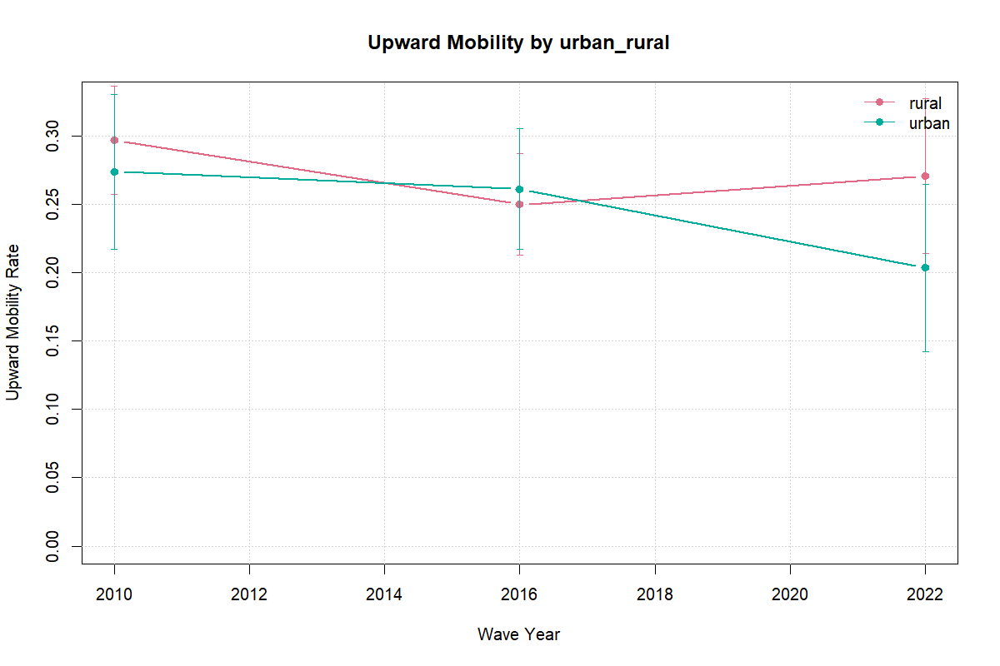

```{r}
source(file.path("..", "R", "91_manuscript_helpers.R"))
load_main_manuscript_context("..")

fmt_int <- function(x) {
  format(as.integer(round(as.numeric(x))), big.mark = ",", trim = TRUE, scientific = FALSE)
}

wave_levels <- c(2010, 2016, 2022)
wave_labels <- c(`2010` = "2010", `2016` = "2016", `2022` = "2022-23")
cohort_levels <- c("25-34", "35-44", "45-54", "55-64")

sample_by_wave <- read_csv_safe(project_file("outputs", "tables", "tier_a_sample_by_wave.csv"))
data_completeness <- read_csv_safe(project_file("outputs", "tables", "tier_a_data_completeness.csv"))
transition_summary <- read_csv_safe(project_file("outputs", "tables", "tier_a_transition_summary.csv"))
region_trends <- read_csv_safe(project_file("outputs", "tables", "tier_a_region_trends.csv"))
subgroup_trends <- read_csv_safe(project_file("outputs", "tables", "tier_a_subgroup_trends.csv"))
subgroup_metrics <- read_csv_safe(project_file("outputs", "tables", "module_a_subgroup_metrics.csv"))
lits_harmonized <- read_csv_safe(project_file("data", "processed", "lits_harmonized.csv"))
hbs_support_context <- read_csv_safe(project_file("outputs", "tables", "hbs_household_support_context.csv"))
hbs_linkage_diagnostics <- read_csv_safe(project_file("data", "processed", "hbs_linkage_diagnostics.csv"))

lits_harmonized$age_num <- suppressWarnings(as.numeric(lits_harmonized$age))
lits_harmonized$wave_year <- suppressWarnings(as.integer(lits_harmonized$wave_year))
lits_harmonized$urban_num <- suppressWarnings(as.numeric(lits_harmonized$urban))
lits_uzb_sample <- lits_harmonized[
  grepl("Uzbekistan$", lits_harmonized$country) &
    !is.na(lits_harmonized$age_num) &
    lits_harmonized$age_num >= 25 &
    lits_harmonized$age_num <= 64,
]

hbs_context_value <- function(metric, column = "national") {
  as.numeric(hbs_support_context[hbs_support_context$metric == metric, column][1])
}
```

## Abstract {.unnumbered}

This paper studies intergenerational educational mobility in Uzbekistan using the 2010, 2016, and 2022-23 waves of the Life in Transition Survey (LiTS). It asks how strongly educational attainment is associated across generations, which household and regional characteristics are correlated with mobility, and what the 2022-23 child module suggests about household learning conditions during pandemic disruption.

The paper's contribution is a reproducible multi-wave mobility profile built around descriptive and associational evidence. The national rank-rank slope rises from `r fmt_num(metric_est("rank_rank_slope", 2010))` in 2010 to `r fmt_num(metric_est("rank_rank_slope", 2016))` in 2016 and remains elevated at `r fmt_num(metric_est("rank_rank_slope", 2022))` in 2022-23. In pooled correlates models, parental rank is positively associated with respondent rank, the 2016 persistence interaction is stronger than in 2010, and parental education remains the clearest predictor of attainment. The LiTS IV child module documents widespread disruption and household-based support, but adjusted parental-education gaps in education stoppage are near zero in the baseline specification and fragile across alternative split rules.

The results point to substantial educational persistence and to the importance of household support conditions, but the time profile is clearer between 2010 and 2016 than between 2016 and 2022-23, and the child-module evidence does not identify a causal pandemic mechanism.

## Introduction

Educational mobility links family background to the allocation of opportunity. When mobility is low, parental education remains a strong predictor of children's schooling, and the distribution of skills is shaped more by inherited circumstance than by individual potential.

Uzbekistan is an important setting for this question. The country combines a young population, persistent regional inequality, and a policy agenda centered on human capital and productivity growth. At the same time, market transition, urbanization, higher-education expansion, and digital change have altered both the returns to schooling and the ways households support children's learning.

This paper uses LiTS repeated cross-sections from 2010, 2016, and 2022-23 to provide a structured profile of intergenerational educational mobility in Uzbekistan. It makes three contributions. First, it documents national mobility patterns using a locked bundle of measures: a rank-rank slope, upward mobility, downward mobility, and same-category persistence. Second, it estimates pooled correlates models with a disciplined set of household and regional controls. Third, it adds a short LiTS IV child-module extension on pandemic-era disruption and support patterns.

The claims are intentionally limited by design. Module A is descriptive, Module B is associational, and Module C is a bounded non-causal extension. Descriptive persistence rises sharply from 2010 to 2016 and remains above the 2010 level in 2022-23, while the pooled persistence model indicates a clearer 2016 strengthening than an additional 2022 shift. The paper therefore emphasizes levels, correlates, and household constraints rather than a causal mechanism claim. Section 2 positions the paper in the literature, Section 3 describes the data and measurement choices, Sections 4-7 present the empirical design and results, and Sections 8-10 discuss interpretation, limitations, and conclusion.

## Related Literature



## Data and Measurement

### Core Data

The main source is the Life in Transition Survey (LiTS) for 2010, 2016, and 2022-23. These repeated cross-sections provide comparable information on respondents' own education, parental education, age, sex, place of residence, and regional identifiers, which makes them suitable for multi-wave mobility analysis.

The analytical sample is restricted to respondents aged 25-64 so that own education is largely complete. Cohorts are grouped as 25-34, 35-44, 45-54, and 55-64. Weighted estimates are used throughout, and subgroup outputs are suppressed when the valid cell size is below 30.

The Household Budget Survey is used only as a supplementary source for context and construct validation, especially around household structure, migration, schooling expenses, tutoring, and internet access. Because direct parent-child linkage in HBS is only partially supported in the current audit, it is not the source of the intergenerational estimates reported here.

### Education Measures

The paper uses two measurement families built from a single parental-education harmonization rule. LiTS parental-schooling responses vary somewhat across waves in wording and granularity, so all observed mother and father responses are first mapped onto a common six-category ladder: no formal education, primary, lower secondary, upper secondary, post-secondary non-tertiary, and tertiary. When both parents are observed, the analysis uses the higher reported category as the parental education measure; when only one parent's schooling is available, the observed value is retained. This rule keeps the comparison consistent across waves while limiting attrition from asymmetric parental reporting. Appendix D2 shows that the rank-based national series is qualitatively stable under alternative parent constructions, although some category-based rates are more sensitive to whether the parent proxy uses the maximum, an average, or a single observed parent.

That harmonized ladder then supports two complementary measures. First, the paper constructs an ordered education score used for category-based mobility rates and pooled attainment regressions. Second, it converts both respondent and parental schooling into within-wave weighted percentile ranks for the rank-rank persistence models. The category-based outcomes preserve the intuitive language of upward mobility, downward mobility, and same-category persistence. The rank-based outcomes, by contrast, are better suited to cross-wave comparison because they are less sensitive to modest questionnaire differences and to aggregate educational expansion. Reporting both is therefore deliberate rather than redundant: one family preserves substantive interpretability, while the other provides the paper's preferred cross-wave benchmark.

### Mobility Outcomes

The main outcomes are:

-   Rank-rank slope: the relationship between own education rank and parental education rank within each wave.
-   Upward mobility: an indicator that own education exceeds parental education.
-   Downward mobility: an indicator that own education is lower than parental education.
-   Persistence: an indicator that own education remains at the same category as parental education.

These measures are reported nationally and, where the denominator permits, by subgroup.

### Covariates

The core covariates in the pooled correlates models are urban residence, female, migration exposure, and multigenerational household structure, with region, cohort, and wave fixed effects. These were selected through the project's audit and coverage rules and represent the active set of non-core controls in the current design.

### Pandemic Mechanism Variables

The 2022-23 LiTS child module is used to create descriptive indicators for remote-learning disruption, learning support, and home-learning constraints. These include switching to online learning, switching to hybrid learning, education stopping during COVID, school closure without online learning, shared-device use, support from mother, father, or relatives, and indicators for internet, device, cost, and time-balance challenges.

The mechanism sample is much smaller than the full LiTS IV sample. The child-module flow moves from `r sample_n("^Uzbekistan LiTS IV respondents$")` Uzbekistan respondents in LiTS IV to `r sample_n("^Respondents with child module eligibility info")` with child-module eligibility information, `r sample_n("^Respondents with child enrolled pre-COVID")` with a child enrolled before COVID, and `r sample_n("^Mechanism sample with non-missing parental schooling$")` with non-missing parental schooling. This extension is therefore used to illustrate patterns rather than to support broad generalization.

## Empirical Strategy

The empirical strategy has three modules and uses one compact notation throughout. Let $Y_{iw}$ denote respondent $i$'s educational outcome in wave $w$, and let $P_{iw}$ denote parental education measured on the corresponding scale. In Module A, $Y_{iw}$ and $P_{iw}$ are within-wave education ranks. In Module B, $Y_i$ alternates across respondent rank, the harmonized education score, an indicator for upward mobility, and an indicator for same-category persistence; $P_i$ likewise denotes parental rank, the parental education score, or a set of parental education-category indicators. $U_i$ and $F_i$ indicate urban residence and female, $X_i$ collects migration exposure and multigenerational household structure, $D_{ti}$ is a wave indicator for $t \in \{2016, 2022\}$ with 2010 as the omitted category, and $\mu_r$, $\lambda_c$, and $\tau_w$ denote region, cohort, and wave effects. In Module C, $L_i$ indicates low parental education and $M_i$ a male child.

### Module A: Mobility Levels and Trends

The first module estimates national mobility levels by wave. Its core descriptive specification is:

$$
Y_{iw} = \alpha_w + \beta_w P_{iw} + \varepsilon_{iw}
$$

where $Y_{iw}$ and $P_{iw}$ are respondent and parental education ranks within wave $w$. The coefficient $\beta_w$ is the within-wave persistence slope: larger values imply that respondent rank tracks parental rank more closely and therefore signal lower relative mobility. The same module also reports weighted rates of upward mobility, downward mobility, and same-category persistence on the harmonized categorical scale.

### Module B: Correlates of Mobility

The second module estimates pooled correlates models with region, cohort, and wave fixed effects. Its pooled benchmark is:

$$
Y_i
= \alpha + \beta P_i
+ \sum_{t \in \{2016, 2022\}} \theta_t \left(P_i \times D_{ti}\right)
+ \rho_1 U_i + \rho_2 F_i + X_i' \gamma + \mu_r + \lambda_c + \tau_w + \varepsilon_i
$$

In the persistence-trend specification, $Y_i$ is respondent rank and $P_i$ is parental rank, so $\theta_t$ captures whether the parent-child gradient in wave $t$ differs from 2010 after conditioning on controls and fixed effects. In the attainment model, $Y_i$ becomes the harmonized education score and $\beta$ is the conditional association between parental and respondent schooling. In the upward-mobility model, $P_i$ is replaced by parental education-category indicators, so the coefficients compare transition probabilities relative to the upper-secondary reference group. The persistence heterogeneity model keeps the same pooled structure but augments it with $P_i \times U_i$, $P_i \times F_i$, and $P_i \times D_{2022,i}$. Throughout, the coefficients are interpreted as conditional associations rather than causal effects.

### Module C: Pandemic-Era Mechanisms

The third module uses the 2022-23 child module to examine whether disruption and support patterns differ by parental education. Its descriptive heterogeneity specification is:

$$
Y_i = \alpha + \beta L_i + \delta_1 U_i + \delta_2 M_i + \kappa \left(L_i \times U_i\right) + \mu_r + \varepsilon_i
$$

where $Y_i$ is a binary child-module outcome estimated with a weighted logit model and region fixed effects. In the main text, the focal case is education stoppage during COVID, so $\beta$ is a log-odds coefficient comparing lower- and higher-parent-education households conditional on controls, while $\kappa$ indicates whether that log-odds gap differs between urban and non-urban households. Parallel estimates for online switching, school closure without online learning, and the broad remote-learning-challenge indicator are reported in the appendix. These regressions are descriptive heterogeneity exercises rather than identification strategies.

## Descriptive Results

### Sample Composition and Completeness

Before turning to the mobility estimates, Table @tbl-sample-composition establishes the analytical base by wave. The age-restricted Uzbekistan LiTS samples contain `r fmt_int(sample_by_wave$n_total[sample_by_wave$wave_year == 2010])` respondents in 2010, `r fmt_int(sample_by_wave$n_total[sample_by_wave$wave_year == 2016])` in 2016, and `r fmt_int(sample_by_wave$n_total[sample_by_wave$wave_year == 2022])` in 2022-23. The 2022-23 wave is somewhat more female in the unweighted analytical sample, although the weighted estimation sample is much closer to balanced, while the cohort mix remains centered on the younger and middle adult cohorts in all three surveys.

The more consequential descriptive issue is now uncertainty rather than missingness. After harmonization, respondents' own education is fully observed in all three waves, while parental education remains observed for `r fmt_pct(data_completeness$parent_ed_non_na[data_completeness$wave_year == 2010] / data_completeness$n_total[data_completeness$wave_year == 2010])` of the 2010 sample, `r fmt_pct(data_completeness$parent_ed_non_na[data_completeness$wave_year == 2016] / data_completeness$n_total[data_completeness$wave_year == 2016])` of the 2016 sample, and `r fmt_pct(data_completeness$parent_ed_non_na[data_completeness$wave_year == 2022] / data_completeness$n_total[data_completeness$wave_year == 2022])` of the 2022-23 sample. The latest-wave caution therefore comes less from a collapsing denominator than from wider confidence intervals in subgroup and regional descriptives.

```{r}
#| label: tbl-sample-composition
#| tbl-cap: "Analytical sample composition and completeness by LiTS wave."
sample_comp_list <- lapply(wave_levels, function(wave) {
  wave_rows <- lits_uzb_sample[lits_uzb_sample$wave_year == wave, ]
  cohort_counts <- table(factor(wave_rows$cohort, levels = cohort_levels))
  cohort_shares <- if (nrow(wave_rows) > 0) {
    100 * as.numeric(cohort_counts) / nrow(wave_rows)
  } else {
    rep(NA_real_, length(cohort_levels))
  }

  data.frame(
    wave_year = wave,
    female_share = mean(wave_rows$gender == "female", na.rm = TRUE),
    urban_share = mean(wave_rows$urban_num == 1, na.rm = TRUE),
    cohort_comp = paste(sprintf("%.1f", cohort_shares), collapse = " / "),
    stringsAsFactors = FALSE
  )
})
sample_comp <- do.call(rbind, sample_comp_list)

sample_table <- merge(
  sample_by_wave[, c("wave_year", "n_total")],
  data_completeness[, c("wave_year", "n_total", "own_ed_non_na", "parent_ed_non_na")],
  by = c("wave_year", "n_total"),
  all.x = TRUE
)
sample_table <- merge(sample_table, sample_comp, by = "wave_year", all.x = TRUE)
sample_table <- sample_table[match(wave_levels, sample_table$wave_year), ]
sample_table$Wave <- unname(wave_labels[as.character(sample_table$wave_year)])
sample_table$`Valid N` <- fmt_int(sample_table$n_total)
sample_table$`Female share` <- fmt_pct(sample_table$female_share)
sample_table$`Urban share` <- fmt_pct(sample_table$urban_share)
sample_table$`Cohort shares (25-34 / 35-44 / 45-54 / 55-64)` <- sample_table$cohort_comp
sample_table$`Own education missing` <- fmt_pct(1 - sample_table$own_ed_non_na / sample_table$n_total)
sample_table$`Parental education missing` <- fmt_pct(1 - sample_table$parent_ed_non_na / sample_table$n_total)

knitr::kable(
  sample_table[, c(
    "Wave",
    "Valid N",
    "Female share",
    "Urban share",
    "Cohort shares (25-34 / 35-44 / 45-54 / 55-64)",
    "Own education missing",
    "Parental education missing"
  )]
)
```

Table @tbl-sample-composition combines the published Tier A sample and completeness outputs with simple analytical-sample composition shares from the harmonized LiTS file; the main takeaway is that the descriptive section rests on usable national samples in every wave and that the harmonized adult sample retains broad parental-education coverage even in 2022-23.

### National Mobility Metrics by Wave

Table @tbl-mobility-metrics reports the paper's locked national mobility measures in a by-wave layout. The rank-rank slope rises from **`r fmt_num(metric_est("rank_rank_slope", 2010))`** in 2010 to **`r fmt_num(metric_est("rank_rank_slope", 2016))`** in 2016 and remains at **`r fmt_num(metric_est("rank_rank_slope", 2022))`** in 2022-23; the corresponding 95 percent confidence intervals are `r metric_ci("rank_rank_slope", 2010)`, `r metric_ci("rank_rank_slope", 2016)`, and `r metric_ci("rank_rank_slope", 2022)`. Category-based rates tell a similar broad story, with persistence rising and downward mobility falling in the later waves.

The harmonized denominator is now aligned across the rank and category measures within each wave. In 2022-23, both the rank-rank slope and the category-based rates rely on `r fmt_int(metric_n("rank_rank_slope", 2022))` valid observations. The main caution is therefore inferential rather than mechanical: the 2022 national estimates remain noisier than the 2016 values, and several subgroup or regional intervals are wide.

```{r}
#| label: tbl-mobility-metrics
#| tbl-cap: "National mobility metrics by LiTS wave."
national_table <- data.frame(
  wave_year = wave_levels,
  stringsAsFactors = FALSE
)
national_table$Wave <- unname(wave_labels[as.character(national_table$wave_year)])
national_table$`Rank-rank slope (95% CI)` <- vapply(
  national_table$wave_year,
  function(wave) paste0(fmt_num(metric_est("rank_rank_slope", wave)), " ", metric_ci("rank_rank_slope", wave)),
  character(1)
)
national_table$`Upward mobility` <- vapply(
  national_table$wave_year,
  function(wave) fmt_pct(metric_est("upward_mobility_rate", wave)),
  character(1)
)
national_table$`Downward mobility` <- vapply(
  national_table$wave_year,
  function(wave) fmt_pct(metric_est("downward_mobility_rate", wave)),
  character(1)
)
national_table$`Persistence` <- vapply(
  national_table$wave_year,
  function(wave) fmt_pct(metric_est("persistence_probability", wave)),
  character(1)
)
national_table$`Valid N` <- vapply(
  national_table$wave_year,
  function(wave) fmt_int(metric_n("rank_rank_slope", wave)),
  character(1)
)

knitr::kable(
  national_table[, c(
    "Wave",
    "Rank-rank slope (95% CI)",
    "Upward mobility",
    "Downward mobility",
    "Persistence",
    "Valid N"
  )]
)
```

Table @tbl-mobility-metrics and Figures @fig-rank-rank and @fig-directional-rates tell the same high-level story: educational persistence is substantial in every wave, the steepest descriptive increase occurs between 2010 and 2016, and the 2022-23 profile remains more persistent than the 2010 baseline without clearly exceeding the 2016 peak once uncertainty is shown.

{#fig-rank-rank fig-alt="Rank-rank slope by LiTS wave."}

{#fig-directional-rates fig-alt="Directional mobility rates by LiTS wave."}

### Transition Structure

The by-wave rates are easier to interpret alongside the transition structure in Table @tbl-transition-structure. In both 2010 and 2016, respondents from lower-secondary and primary parental origins most often reach upper secondary, while respondents from upper-secondary parental origins remain concentrated in the same category. This is consistent with a system that permits some upward movement from lower origins but still exhibits strong persistence around the upper-secondary category that dominates the analytical sample.

The 2022-23 transition matrix remains thin at the lowest parental origins, but it is no longer confined to a single usable row. The tertiary parental-origin row shows `r fmt_pct(transition_summary$share[transition_summary$wave_year == 2022 & transition_summary$parent_ed_level == "tertiary" & transition_summary$own_ed_level == "tertiary"])` same-category persistence out of `r fmt_int(transition_summary$n_parent_total[transition_summary$wave_year == 2022 & transition_summary$parent_ed_level == "tertiary" & transition_summary$own_ed_level == "tertiary"])` valid cases, while the upper-secondary parental-origin row shows `r fmt_pct(transition_summary$share[transition_summary$wave_year == 2022 & transition_summary$parent_ed_level == "upper_secondary" & transition_summary$own_ed_level == "tertiary"])` movement into tertiary and `r fmt_pct(transition_summary$share[transition_summary$wave_year == 2022 & transition_summary$parent_ed_level == "upper_secondary" & transition_summary$own_ed_level == "upper_secondary"])` same-category persistence out of `r fmt_int(transition_summary$n_parent_total[transition_summary$wave_year == 2022 & transition_summary$parent_ed_level == "upper_secondary" & transition_summary$own_ed_level == "upper_secondary"])` valid cases. The main takeaway is that the transition evidence reinforces strong persistence at the top of the ladder while lower-origin 2022 rows remain too sparse for fine-grained inference.

```{r}
#| label: tbl-transition-structure
#| tbl-cap: "Transition structure for parental-origin categories with usable cell counts."
transition_main <- transition_summary[
  transition_summary$wave_year %in% c(2010, 2016) &
    transition_summary$parent_ed_level %in% c("primary", "lower_secondary", "upper_secondary"),
]
transition_main$share_display <- ifelse(
  transition_main$status == "ok" & !is.na(transition_main$share),
  fmt_pct(transition_main$share),
  "Suppressed"
)
transition_wide <- reshape(
  transition_main[, c("wave_year", "parent_ed_level", "own_ed_level", "share_display")],
  idvar = c("wave_year", "parent_ed_level"),
  timevar = "own_ed_level",
  direction = "wide"
)
parent_totals <- unique(transition_main[, c("wave_year", "parent_ed_level", "n_parent_total")])
transition_wide <- merge(transition_wide, parent_totals, by = c("wave_year", "parent_ed_level"), all.x = TRUE)
transition_wide <- transition_wide[
  order(
    transition_wide$wave_year,
    match(transition_wide$parent_ed_level, c("primary", "lower_secondary", "upper_secondary"))
  ),
]
transition_wide$Wave <- unname(wave_labels[as.character(transition_wide$wave_year)])
transition_wide$`Parental origin` <- c(
  primary = "Primary",
  lower_secondary = "Lower secondary",
  upper_secondary = "Upper secondary"
)[transition_wide$parent_ed_level]
transition_wide$`Own: Primary` <- transition_wide$share_display.primary
transition_wide$`Own: Lower secondary` <- transition_wide$share_display.lower_secondary
transition_wide$`Own: Upper secondary` <- transition_wide$share_display.upper_secondary
transition_wide$`Parent-origin N` <- fmt_int(transition_wide$n_parent_total)

knitr::kable(
  transition_wide[, c(
    "Wave",
    "Parental origin",
    "Own: Primary",
    "Own: Lower secondary",
    "Own: Upper secondary",
    "Parent-origin N"
  )]
)
```

### Descriptive Heterogeneity

#### Cohort Profiles

Figure @fig-cohort-rank-rank shows that the rank-based persistence gradient differs across cohorts, even though all cohort profiles remain positive. The youngest adult cohort moves from a slope of **`r fmt_num(subgroup_trends$estimate[subgroup_trends$subgroup_type == "cohort" & subgroup_trends$subgroup_value == "25-34" & subgroup_trends$metric == "rank_rank_slope" & subgroup_trends$wave_year == 2010])`** in 2010 to **`r fmt_num(subgroup_trends$estimate[subgroup_trends$subgroup_type == "cohort" & subgroup_trends$subgroup_value == "25-34" & subgroup_trends$metric == "rank_rank_slope" & subgroup_trends$wave_year == 2022])`** in 2022-23, while the oldest cohort stays closer to one quarter throughout the period. These are descriptive cross-cohort differences rather than cohort effects identified from a panel.

```{r}
#| label: fig-cohort-rank-rank
#| fig-cap: "Rank-rank persistence by cohort and LiTS wave."
cohort_plot <- subgroup_trends[
  subgroup_trends$subgroup_type == "cohort" &
    subgroup_trends$metric == "rank_rank_slope",
]
cohort_plot$Wave <- factor(
  cohort_plot$wave_year,
  levels = wave_levels,
  labels = unname(wave_labels[as.character(wave_levels)])
)
cohort_plot$Cohort <- factor(cohort_plot$subgroup_value, levels = cohort_levels)

ggplot2::ggplot(
  cohort_plot,
  ggplot2::aes(x = Wave, y = estimate, group = Cohort, color = Cohort)
) +
  ggplot2::geom_line(linewidth = 0.8) +
  ggplot2::geom_point(size = 2.3) +
  ggplot2::scale_color_manual(
    values = c("25-34" = "#1b6ca8", "35-44" = "#8c564b", "45-54" = "#2a9d8f", "55-64" = "#c56b00")
  ) +
  ggplot2::labs(x = NULL, y = "Rank-rank slope", color = "Cohort") +
  ggplot2::theme_minimal(base_size = 10) +
  ggplot2::theme(legend.position = "bottom")
```

The main takeaway is that cohort profiles are heterogeneous in levels, but they do not overturn the broader descriptive picture of substantial persistence across all waves.

#### Regional Variation

Regional dispersion is most legible in the rank-based measure, because the 2022 category-based regional outputs remain sparse for many origin cells. Figure @fig-region-rank-rank ranks the 2022-23 regional slopes and shows a wide descriptive spread around the national slope of **`r fmt_num(metric_est("rank_rank_slope", 2022))`**. The highest observed persistence appears in Tashkent city at **`r fmt_num(region_trends$estimate[region_trends$region == "Tashkent city" & region_trends$wave_year == 2022 & region_trends$metric == "rank_rank_slope"])`**, while Khorezm region sits near **`r fmt_num(region_trends$estimate[region_trends$region == "Khorezm region" & region_trends$wave_year == 2022 & region_trends$metric == "rank_rank_slope"])`**. These regional differences are descriptive and several intervals remain wide, so they should be read as dispersion rather than ranked certainty.

```{r}
#| label: fig-region-rank-rank
#| fig-cap: "Regional dispersion in the 2022-23 rank-rank slope."
region_plot <- region_trends[
  region_trends$wave_year == 2022 &
    region_trends$metric == "rank_rank_slope" &
    !is.na(region_trends$estimate) &
    !is.na(region_trends$n),
]
region_plot <- region_plot[order(region_plot$estimate), ]
region_plot$region <- factor(region_plot$region, levels = region_plot$region)
national_2022_slope <- metric_est("rank_rank_slope", 2022)

ggplot2::ggplot(region_plot, ggplot2::aes(x = estimate, y = region, size = n)) +
  ggplot2::geom_segment(
    ggplot2::aes(x = 0, xend = estimate, y = region, yend = region),
    color = "grey80",
    linewidth = 0.5
  ) +
  ggplot2::geom_vline(xintercept = national_2022_slope, linetype = "dashed", color = "grey45") +
  ggplot2::geom_point(color = "#1b6ca8") +
  ggplot2::scale_size_continuous(name = "Valid N", range = c(2.5, 5.5)) +
  ggplot2::labs(x = "Rank-rank slope", y = NULL) +
  ggplot2::theme_minimal(base_size = 10) +
  ggplot2::theme(legend.position = "bottom")
```

The main takeaway is that regional differences are descriptively large enough to matter for interpretation, even though the paper does not treat them as identified regional effects and several regional estimates remain imprecise.

#### Subgroup Split

Figure @fig-upward-urban-rural brings one existing subgroup visual into the main text. The urban-rural split is worth showing because it connects directly to the paper's pooled correlates framework, but it should still be read as descriptive because the figure is based on the category-coded upward-mobility rate rather than the paper's preferred rank-based trend benchmark.

The companion gender split is not promoted to the main text because the 2022-23 male category-mobility sample is only `r fmt_int(subgroup_metrics$n[subgroup_metrics$subgroup_type == "gender" & subgroup_metrics$subgroup_value == "male" & subgroup_metrics$metric == "upward_mobility_rate" & subgroup_metrics$wave_year == 2022])` with a weighted effective N of about `r fmt_num(subgroup_metrics$effective_n[subgroup_metrics$subgroup_type == "gender" & subgroup_metrics$subgroup_value == "male" & subgroup_metrics$metric == "upward_mobility_rate" & subgroup_metrics$wave_year == 2022], digits = 1)`, which makes that panel less informative than the urban-rural comparison.

{#fig-upward-urban-rural fig-alt="Upward mobility by urban and rural residence."}

The main takeaway is that subgroup descriptives are useful for orientation, but the rank-based national series remains the most reliable summary of cross-wave mobility levels.

## Correlates of Educational Mobility

### Pooled Persistence-Trend Model

The pooled rank-based persistence model shows a clear positive association between parental rank and respondent rank. The coefficient on parental rank is **`r fmt_num(coef_est("eq2_persistence_trend", "parent_rank"))`**, the interaction with 2016 is positive and precisely estimated at **`r fmt_num(coef_est("eq2_persistence_trend", "wave_year_fe::2016:parent_rank"))`**, and the additional 2022 interaction is also positive but only marginally estimated at **`r fmt_num(coef_est("eq2_persistence_trend", "wave_year_fe::2022:parent_rank"))`**.

This result sharpens the descriptive reading. Once the model adds region, cohort, wave fixed effects, and the selected covariates, the data support a stronger parent-child gradient in 2016 than in 2010, while the 2022-23 gradient remains above the 2010 baseline but is less clearly distinguished from the 2016 level. The pooled evidence therefore supports persistence and a mid-period strengthening more clearly than a monotonic worsening in every later wave.

### Attainment-Score Model

The attainment-score regression shows a robust positive association between parental education and own educational attainment. The coefficient on parental education score is **`r fmt_num(coef_est("eq3_attainment_score", "parent_ed_score"))`** and is precisely estimated. This is the clearest correlates result in the paper: better-educated parents are associated with higher educational attainment among adult children even after adding fixed effects and the active covariates.

Among the non-parental covariates, none is precisely estimated in the current pooled specification. The female coefficient is slightly negative at **`r fmt_num(coef_est("eq3_attainment_score", "female"))`**, while urban residence, migration exposure, and multigenerational household structure are likewise imprecisely estimated. The central correlates result is therefore narrow: parental educational background remains the strongest and most stable predictor in the pooled attainment model.

### Upward Mobility Models

The upward-mobility linear probability models are useful mainly for showing where upward transitions are mechanically more likely. Relative to the upper-secondary reference group, respondents from primary-educated households and lower-secondary households have much higher estimated probabilities of upward mobility, with coefficients of **`r fmt_num(coef_est("eq4_upward_full_lpm", "parent_ed_level::primary"))`** and **`r fmt_num(coef_est("eq4_upward_full_lpm", "parent_ed_level::lower_secondary"))`**, respectively.

The non-parental covariates in the upward-mobility models are weaker. Urban residence is close to zero, migration exposure is not precisely estimated, and multigenerational household structure is negligible. The one clearer non-parental pattern is a lower upward-mobility probability for women conditional on the same controls. In substantive terms, the upward-mobility models still mostly reflect where households begin in the parental education ladder rather than strong independent roles for the additional covariates.

### Heterogeneity in Persistence

The persistence heterogeneity model shows a positive association between parental education score and the probability of remaining in the same education category as one's parents. The coefficient on parental education score is **`r fmt_num(coef_est("eq5_persistence_heterogeneity", "parent_ed_score"))`** and is precisely estimated.

The interaction pattern differs from the earlier draft. The urban and female interaction terms are small and not precisely estimated, while the interaction between parent education and the 2022 wave is positive at **`r fmt_num(coef_est("eq5_persistence_heterogeneity", "parent_ed_score:wave2022"))`** and precisely estimated. A cautious reading is that parental education translates into same-category persistence across the full sample, and that this translation is stronger in 2022-23 than in the earlier pooled baseline, but there is little evidence here of separate urban or female heterogeneity in that persistence gradient. Table @tbl-pooled-correlates collects the selected coefficients discussed in Section 6.

```{r}
#| label: tbl-pooled-correlates
#| tbl-cap: "Selected pooled correlates estimates."
selected_terms <- c(
  "eq2_persistence_trend::parent_rank",
  "eq2_persistence_trend::wave_year_fe::2016:parent_rank",
  "eq2_persistence_trend::wave_year_fe::2022:parent_rank",
  "eq3_attainment_score::parent_ed_score",
  "eq3_attainment_score::female",
  "eq4_upward_full_lpm::parent_ed_level::primary",
  "eq4_upward_full_lpm::parent_ed_level::lower_secondary",
  "eq5_persistence_heterogeneity::parent_ed_score",
  "eq5_persistence_heterogeneity::parent_ed_score:wave2022",
  "eq5_persistence_heterogeneity::parent_ed_score:urban",
  "eq5_persistence_heterogeneity::parent_ed_score:female"
)
model_labels <- c(
  eq2_persistence_trend = "Persistence trend",
  eq3_attainment_score = "Attainment score",
  eq4_upward_full_lpm = "Upward mobility",
  eq5_persistence_heterogeneity = "Persistence heterogeneity"
)
term_labels <- c(
  parent_rank = "Parent rank",
  "wave_year_fe::2016:parent_rank" = "Parent rank x 2016",
  "wave_year_fe::2022:parent_rank" = "Parent rank x 2022-23",
  parent_ed_score = "Parent education score",
  female = "Female",
  "parent_ed_level::primary" = "Parent education: primary",
  "parent_ed_level::lower_secondary" = "Parent education: lower secondary",
  "parent_ed_score:wave2022" = "Parent education score x 2022-23",
  "parent_ed_score:urban" = "Parent education score x urban",
  "parent_ed_score:female" = "Parent education score x female"
)

module_b_table <- module_b_coef[
  paste(module_b_coef$model, module_b_coef$term, sep = "::") %in% selected_terms,
  c("model", "term", "estimate", "std.error", "p.value")
]
module_b_table$order_key <- match(
  paste(module_b_table$model, module_b_table$term, sep = "::"),
  selected_terms
)
module_b_table <- module_b_table[order(module_b_table$order_key), ]
module_b_table$Model <- unname(model_labels[module_b_table$model])
module_b_table$Term <- unname(term_labels[module_b_table$term])
module_b_table$Estimate <- fmt_num(module_b_table$estimate)
module_b_table$`Std. Error` <- fmt_num(module_b_table$std.error)
module_b_table$`P-value` <- vapply(module_b_table$p.value, fmt_p, character(1))

knitr::kable(
  module_b_table[, c("Model", "Term", "Estimate", "Std. Error", "P-value")]
)
```

### Household Support Environment from HBS

Supplementary HBS evidence is used here only to characterize the household support environment around schooling, not to replace the core LiTS intergenerational estimates. Across pooled HBS 2021-2025 households, `r fmt_pct(hbs_context_value("has_enrolled_member"))` had an enrolled member, `r fmt_pct(hbs_context_value("education_spending_positive"))` reported positive education spending, `r fmt_pct(hbs_context_value("has_tutoring"))` reported tutoring, `r fmt_pct(hbs_context_value("has_emigrant_hh"))` had an emigrant member, and `r fmt_pct(hbs_context_value("has_remittance_hh"))` received remittances; internet access is observed for `r fmt_pct(hbs_context_value("internet_access_hh"))` of households in the 2021-2024 internet module. These patterns provide context for interpretation by showing that schooling support, migration-linked resources, and connectivity constraints sit inside the same household environment as the LiTS persistence patterns.

The HBS linkage diagnostics in Appendix H also show why HBS remains supplementary. Under a conservative co-resident linkage rule, only `r fmt_pct(hbs_linkage_diagnostics$link_rate[1])` of HBS adults ages 25-64 are linkable, and that linked sample is materially younger and much less female than the full adult sample. HBS therefore informs the household support environment, but it is not a direct substitute for the headline LiTS intergenerational estimates.

```{r}
#| label: tbl-hbs-context
#| tbl-cap: "Supplementary HBS household support environment, pooled 2021-2025."
hbs_context_table <- hbs_support_context[, c("row_label", "national", "urban", "rural")]
hbs_context_table$National <- fmt_pct(hbs_context_table$national)
hbs_context_table$Urban <- fmt_pct(hbs_context_table$urban)
hbs_context_table$Rural <- fmt_pct(hbs_context_table$rural)

knitr::kable(
  hbs_context_table[, c("row_label", "National", "Urban", "Rural")],
  col.names = c("Household support indicator", "National", "Urban", "Rural")
)
```

## Bounded LiTS IV Child Module Extension

### Sample and Disruption Profile

The child-module extension is deliberately kept secondary to Modules A and B. It is based on `r sample_n("^Mechanism sample with non-missing parental schooling$")` respondents with a child enrolled before COVID and non-missing parental schooling. Table @tbl-modulec-sample reports the sample flow.

Within this restricted sample, disruption and household substitution were substantial: **`r fmt_pct(mech_est("education_stopped_covid"))`** report education stoppage during COVID, **`r fmt_pct(mech_est("any_remote_challenge"))`** report at least one remote-learning challenge, and mothers are reported as the learning-support channel in **`r fmt_pct(mech_est("support_mother"))`** of cases. Additional descriptive splits and the fragility checks for the mechanism regressions are reported in the technical appendix so that the main text remains focused on the strongest facts.

```{r}
#| label: tbl-modulec-sample
#| tbl-cap: "LiTS IV child-module sample construction for Uzbekistan."
module_c_sample_table <- module_c_sample
names(module_c_sample_table) <- c("Step", "N")
knitr::kable(
  module_c_sample_table
)
```

### Main Regression Takeaway

The adjusted regression evidence is much weaker than the descriptive disruption rates. In the baseline weighted median-split specification, the coefficient on low parental education in the stoppage model is **`r fmt_num(mech_coef_est("m3_education_stopped_covid", "parent_low_edu"))`** with p-value **`r fmt_p(mech_coef_p("m3_education_stopped_covid", "parent_low_edu"))`**, and the descriptive stoppage rates are nearly identical: **`r fmt_pct(mech_est("education_stopped_covid", "parent_education", "lower_or_equal_median_parent_edu"))`** among children from lower-parent-education households versus **`r fmt_pct(mech_est("education_stopped_covid", "parent_education", "above_median_parent_edu"))`** among those from higher-parent-education households.

The technical appendix shows that the stoppage coefficient is fragile across weighting and threshold choices and becomes unstable under the strict `<=9` split. Module C therefore contributes bounded descriptive evidence on household vulnerability and learning support, not a stable adjusted parental-education gradient and not causal evidence on pandemic mechanisms.

## Discussion and Policy Implications

Three broad conclusions emerge from the analysis.

First, Uzbekistan exhibits substantial intergenerational educational persistence. Descriptive persistence rises strongly from 2010 to 2016 and remains above the 2010 level in 2022-23. The pooled rank-based model supports a stronger persistence gradient in 2016 relative to 2010, while the additional 2022 increment is less precisely estimated.

Second, parental education is the most consistent predictor in the pooled correlates models. The data provide less clear evidence that migration exposure or multigenerational household structure independently explain mobility once the core controls and fixed effects are added, although these factors may still matter through channels the present specifications do not capture well.

Third, the pandemic mechanism evidence underscores the practical importance of household learning conditions. Device sharing, internet quality, and time- or cost-related constraints were common, and support was overwhelmingly provided by mothers. What the child module establishes most clearly is the scale of disruption and household substitution, not a robust adjusted stoppage gap by parental education.

These findings imply several policy priorities. The first is to reduce the degree to which educational attainment depends on parental background through earlier remedial support, stronger transitions across schooling stages, and wider access to quality secondary and post-secondary pathways. The second is to address spatial and household bottlenecks directly. Even without a precise pooled urban coefficient, the broader descriptive evidence points to local infrastructure, service access, and household support conditions as meaningful constraints on mobility.

The third priority is to strengthen household support capacity in periods of disruption. The child module shows that digital inclusion is not only a question of nominal internet access, but also of connection quality, device availability, and adults' ability to help children learn. A related implication is that education policy should recognize mothers' support burden as a real part of learning continuity rather than assume that home-based adjustment is costless inside the household.

## Limitations

This paper has four main limitations.

First, the three LiTS waves are repeated cross-sections rather than a panel, so changes over time should be interpreted as changes in population-level patterns rather than changes within fixed families.

Second, the comparability of some parental education information across waves is imperfect, which is why the rank-based measures are more reliable than some category-based comparisons.

Third, several 2022-23 subgroup and regional estimates remain noisy even after the harmonized denominator problem is resolved. The national 2022 profile is informative, but some disaggregated category-based and regional comparisons still have wide confidence intervals or sparse origin cells.

Fourth, the pandemic mechanism module is based on a limited child subsample and is not a causal design. Its adjusted parental-education coefficients are also fragile across weighting and threshold choices, so it is useful for describing disruption and support patterns rather than for establishing a stable mechanism.

These limitations do not undermine the central contribution of the paper, but they do shape the appropriate scope of the conclusions.

## Conclusion

This paper provides structured multi-wave evidence on intergenerational educational mobility in Uzbekistan using LiTS 2010, 2016, and 2022-23. The results indicate substantial educational persistence across generations. Descriptive persistence rises from 2010 to 2016 and remains elevated in 2022-23, while the pooled correlates models point to a stronger mid-period persistence gradient and continue to show parental education as the clearest predictor of children's educational attainment.

The extension based on the LiTS IV child module shows that pandemic-era learning disruption was widespread and that household support, especially maternal support, was central to learning continuity. The same extension does not provide robust adjusted evidence that lower parental education raised the probability that education stopped during COVID.

The broader message is that improving educational mobility in Uzbekistan will require more than expanding formal access. It will require reducing the degree to which family background governs educational trajectories, especially through the unequal household conditions under which children study, recover from shocks, and convert schooling opportunities into completed attainment.
