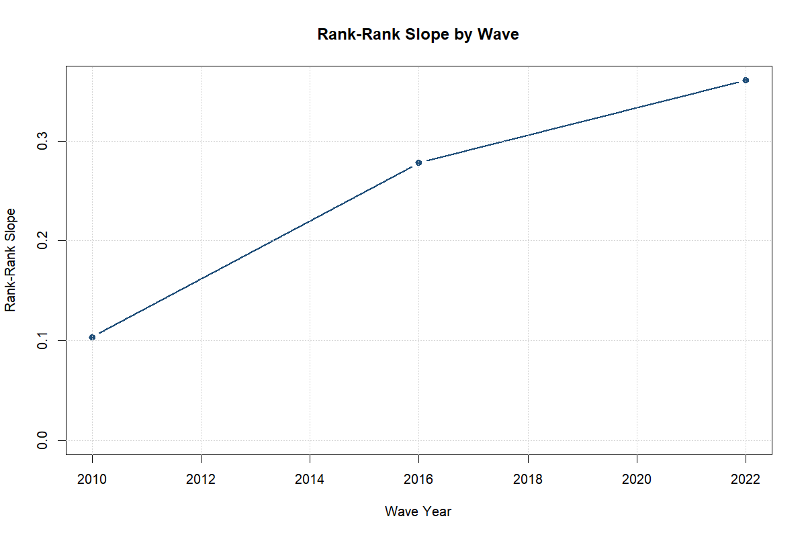
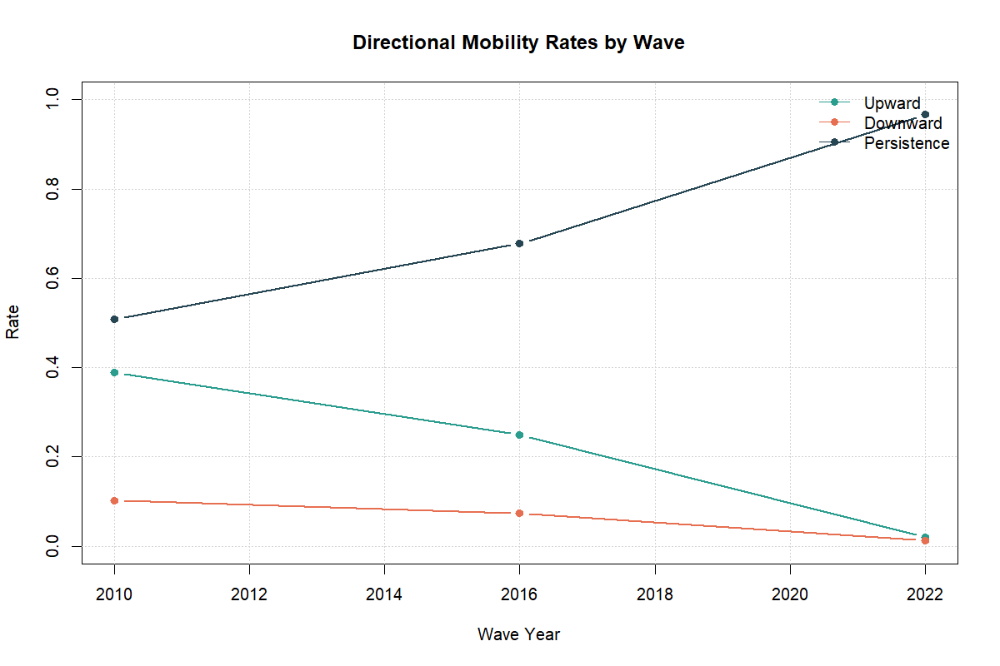

## Executive Summary

This report presents the main results of the project across three modules:
mobility measurement, determinants, and pandemic mechanism evidence.

## Research Questions

1. How has intergenerational education mobility changed across cohorts and regions?
2. Which household and regional factors are associated with mobility gaps?
3. Did post-2017 reforms shift mobility-related outcomes?

## Data

Primary inputs:
- LiTS 2010, 2016, 2022-23
- Household Budget Survey
- Administrative region-year education panel (2010-2024)

## Module A: Mobility Metrics

```{r}
read_csv_safe <- function(path) {
  tryCatch(
    utils::read.csv(path),
    error = function(e) data.frame(note = paste("Could not read", basename(path), "-", conditionMessage(e)))
  )
}

summary_file <- file.path("..", "outputs", "tables", "module_a_summary_metrics.csv")
if (file.exists(summary_file)) {
  read_csv_safe(summary_file)
} else {
  data.frame(note = "Run pipeline first to populate Module A outputs.")
}
```

## Tier A Descriptive Trends

```{r}
tier_a_national <- file.path("..", "outputs", "tables", "tier_a_national_trends.csv")
if (file.exists(tier_a_national)) {
  read_csv_safe(tier_a_national)
} else {
  data.frame(note = "Run pipeline first to populate Tier A trend outputs.")
}
```

```{r}
tier_a_sample <- file.path("..", "outputs", "tables", "tier_a_sample_by_wave.csv")
if (file.exists(tier_a_sample)) {
  read_csv_safe(tier_a_sample)
} else {
  data.frame(note = "Run pipeline first to populate Tier A sample counts.")
}
```





## Module B: Determinants

```{r}
coef_file <- file.path("..", "outputs", "tables", "module_b_model_coefficients.csv")
if (file.exists(coef_file)) {
  coef_df <- read_csv_safe(coef_file)
  keep_cols <- intersect(c("model", "term", "estimate", "std.error", "p.value"), names(coef_df))
  if (length(keep_cols) == 0) coef_df else coef_df[keep_cols]
} else {
  data.frame(note = "Run pipeline first to populate Module B outputs.")
}
```

```{r}
cov_file <- file.path("..", "outputs", "tables", "module_b_covariate_coverage.csv")
sel_file <- file.path("..", "outputs", "tables", "module_b_selected_covariates.csv")
if (file.exists(cov_file)) {
  read_csv_safe(cov_file)
} else {
  data.frame(note = "Covariate coverage not available yet.")
}
if (file.exists(sel_file)) {
  read_csv_safe(sel_file)
} else {
  data.frame(note = "Selected covariates not available yet.")
}
```

## Module C: Pandemic Mechanisms (LiTS IV)

```{r}
mech_sample_file <- file.path("..", "outputs", "tables", "module_c_mechanism_sample.csv")
if (file.exists(mech_sample_file)) {
  read_csv_safe(mech_sample_file)
} else {
  data.frame(note = "Run pipeline first to populate Module C sample outputs.")
}
```

```{r}
mech_summary_file <- file.path("..", "outputs", "tables", "module_c_mechanism_summary.csv")
if (file.exists(mech_summary_file)) {
  read_csv_safe(mech_summary_file)
} else {
  data.frame(note = "Run pipeline first to populate Module C mechanism summary outputs.")
}
```

```{r}
mech_coef_file <- file.path("..", "outputs", "tables", "module_c_mechanism_coefficients.csv")
mech_formula_file <- file.path("..", "outputs", "tables", "module_c_mechanism_formulae.csv")
if (file.exists(mech_coef_file)) {
  coef_df <- read_csv_safe(mech_coef_file)
  keep_cols <- intersect(c("model", "term", "estimate", "std.error", "p.value"), names(coef_df))
  if (length(keep_cols) == 0) coef_df else coef_df[keep_cols]
} else {
  data.frame(note = "Module C mechanism coefficient outputs are not available yet.")
}
if (file.exists(mech_formula_file)) {
  read_csv_safe(mech_formula_file)
} else {
  data.frame(note = "Module C mechanism model specifications are not available yet.")
}
```

```{r}
robust_scenario_file <- file.path("..", "outputs", "tables", "module_c_mechanism_robustness_scenarios.csv")
robust_coef_file <- file.path("..", "outputs", "tables", "module_c_mechanism_robustness_coefficients.csv")
if (file.exists(robust_scenario_file)) {
  read_csv_safe(robust_scenario_file)
} else {
  data.frame(note = "Module C robustness scenario table is not available yet.")
}
if (file.exists(robust_coef_file)) {
  rdf <- read_csv_safe(robust_coef_file)
  keep_cols <- intersect(c("scenario_id", "model", "outcome", "term", "estimate", "std.error", "p.value", "status"), names(rdf))
  if (length(keep_cols) == 0) rdf else rdf[keep_cols]
} else {
  data.frame(note = "Module C robustness coefficient table is not available yet.")
}
```

### Table 5 Interpretation (Mechanisms + Robustness)

The mechanisms evidence is best interpreted as **descriptive and heterogeneity-based**, not causal.

Main takeaways from the LiTS IV child module:
- Remote-learning disruption was widespread in the mechanism sample: online/hybrid switching and school closure without online learning are all common outcomes.
- Constraint indicators are also high: many households report internet/device/time-cost challenges, and shared device use is frequent.
- Learning support is heavily concentrated within the household, with mothers as the primary support channel.

Robustness judgment for heterogeneity by parental education:
- The `<=9 years` split is **not reliable** for inference because the low-education subgroup is too small (`n=7`), producing separation-like extreme coefficients.
- The median split and `<=11` split are much more balanced and should be treated as the main robustness checks.
- Across these balanced splits, the main effect of low parental education is **not consistently stable** across outcomes/specifications.
- The most persistent signal is in the interaction term `parent_low_edu:urban` for remote-learning challenge outcomes, but even this should be treated as suggestive given small sample size and fixed-effect attrition.

Bottom line for Table 5:
- Report Module C as **mechanism evidence with heterogeneity patterns**, not as a standalone causal claim.
- Emphasize direction and consistency across balanced robustness scenarios, and explicitly down-weight the `<=9` specification.

## Policy Implications

Policy recommendations should prioritize practical bottlenecks revealed by the mechanism module:
- household digital access quality (not just binary internet availability),
- shared-device constraints,
- support capacity for at-home learning.

Final policy language should note that estimates are based on a limited child-module subsample and are therefore suggestive.
